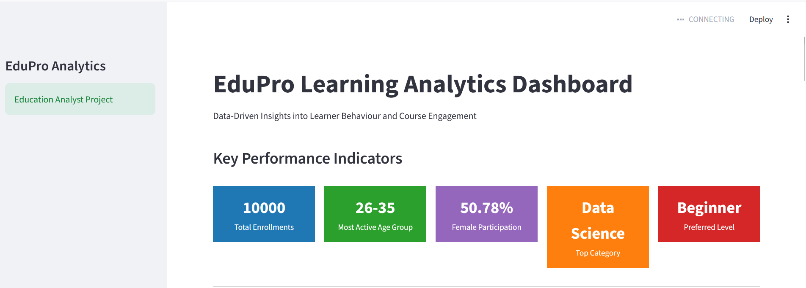
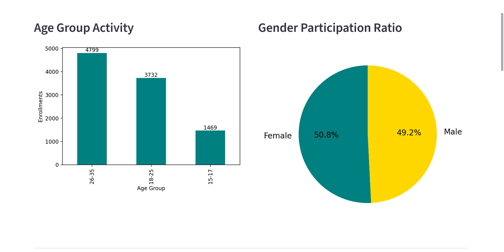
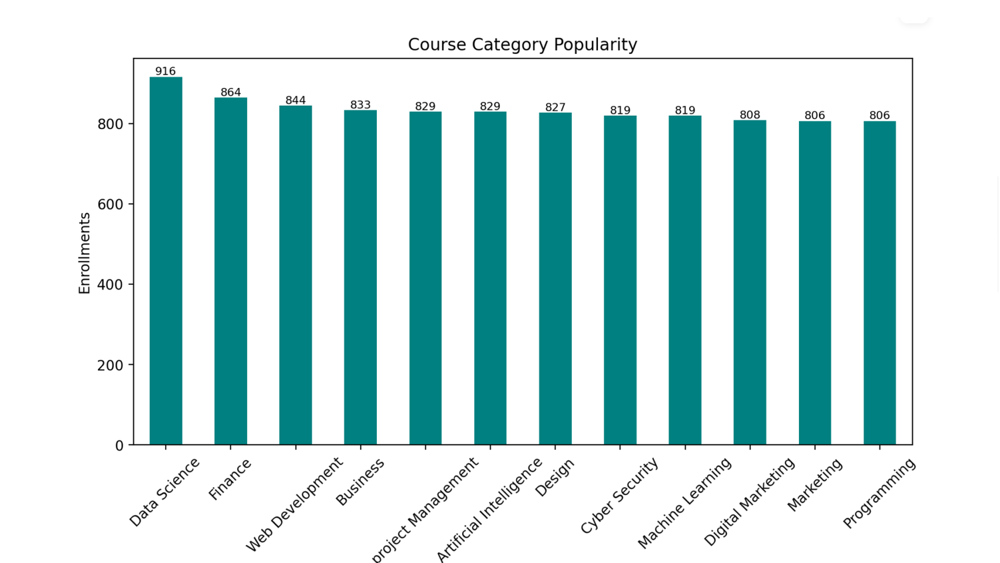
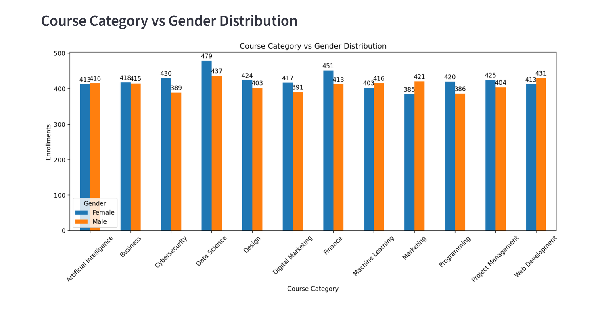

# EduPro Learning Analytics Dashboard

## Project Overview

EduPro Analytics is an education analytics project focused on understanding learner behavior, course preferences, and enrollment patterns using data analysis and visualization.
The project analyzes user transactions, course information, and learner demographics to identify insights that can help improve course recommendations and platform engagement strategies.
The final output is an interactive Streamlit dashboard presenting key performance indicators and analytical visualizations.

## Problem Statement

Learner activity and course enrollment data  were analyzed to understand:
- which  course categories attract the highest enrollments?
- Do beginners prefer specific course types or levels?
- How do enrollment patterns differ by gender?
- which learner groups are most active on the platform?

## Dataset
The dataset contains four sheets:
- Users
- Teachers
- Courses
- Transactions
The data was provided in excel format and processed using Python.

## Technologies Used
- Python
- Pandas
- Matplotlib
- Streamlit
- Jupyter Notebook
- Openpyxl

## Exploratory Data Analysis (EDA)
The following analyses were performed:

### Learner Analysis

- Age group distribution
- Active learner segments
- Gender participation analysis

### Course Analysis

- Course category popularity
- Course level preference
- Free vs Paid course preference

### Enrollment Analysis

- Course category vs enrollments
- Gender vs course category distribution
- Course type vs course level analysis

## Dashboard Preview
### KPi cards

### Age and GEnder Analysis

### Course Category Analysis

### Course Level Analysis

### Course category vs gender distribution

## Dashboard Features

The streamlit dashboard includes:

- KPI cards
  - Total enrollments
  - Most active age group
  - Gender participation ratio
  - Top course category
  - Preferred course level

- Interactive visualizations:
  - Age Group Activity
  - Gender Participation Ratio
  - Course Category vs Enrollments
  - Gender vs Course Category
  - Course Level Preference
  - Course Type vs Course Level

## Project Structure

EDUPRO-ANALYTICS/
|
|___ app.py
|___ analysis.ipynb
|___ requirements.txt
|___ data/
|      |___ EduPro.xlsx

## How to Run the Project

Streamlit dashboard was run by following command:

streamlit run app.py

## Key Insights

- Beginner level courses received the highest enrollment.
- Female and male learner participation was almost balanced.
- Data Science was among the most preferred course categories.
- Learners showed higher preference for beginner and free courses.

## Author
EduPro Analytics Dashboard
Built as an Education Analyst Project using Python and Streamlit

